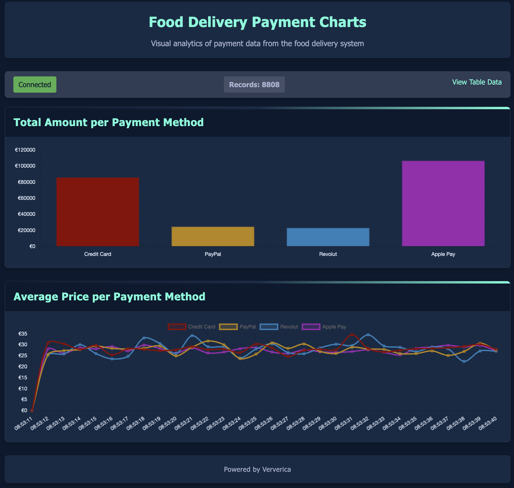
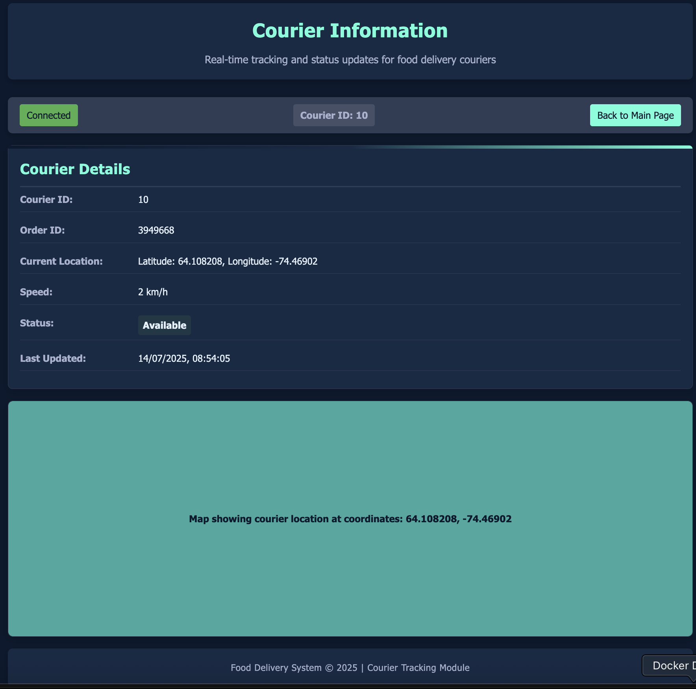

# Food Delivery Application

<p align="center">
    
</p>


This document provides instructions on how to run the Food Delivery application and access its endpoints.

## Running the Application

### Option 1: Running with Java

1. Make sure you have Java 17 or later installed.
2. Navigate to the `fluss-food-delivery` directory.
3. Build the application using Maven:
   ```
   mvn clean package
   ```
4. Run the application:
   ```
   java -jar target/fluss-food-delivery-*.jar
   ```

### Option 2: Running with Docker Compose

1. Make sure you have Docker and Docker Compose installed.
2. Navigate to the `fluss-food-delivery` directory.
3. Start the application using Docker Compose:
   ```
   docker-compose up -d
   ```
4. To stop the application:
   ```
   docker-compose down
   ```

## Accessing the Application

Once the application is running, you can access it through the following endpoints:

### Web UI

- **Main Dashboard**: http://localhost:8080
  - Displays real-time payment information from the food delivery system in a table format.

- **Charts Dashboard**: http://localhost:8080/charts.html
  - Displays visual analytics of payment data with bar and line charts.

### API Endpoints

- **Payment Stream**: http://localhost:8080/api/payments
  - Returns a stream of order payment data in Server-Sent Events (SSE) format.
  - Used by the web UI to display real-time payment information.

- **Courier Information**: http://localhost:8080/api/courier/{id}
  - Returns information about a specific courier in JSON format.
  - Replace `{id}` with the actual courier ID.

- **Courier Page**: http://localhost:8080/courier/{id}
  - Returns an HTML page with information about a specific courier.
  - Replace `{id}` with the actual courier ID.

## System Architecture

The application consists of several components:

1. **Spring Boot Application**: Serves the web UI and API endpoints.
2. **Fluss Scanner**: Connects to the data source and polls for order payment records.
3. **Flink Job**: Processes the data stream.

The system uses the following technologies:
- Spring Boot for the web application
- Fluss for data streaming
- Flink for stream processing
- Paimon for data storage
- ZooKeeper for coordination

## Charts Page
<p align="center">
    
</p>

## Location Page
<p align="center">
    
</p>